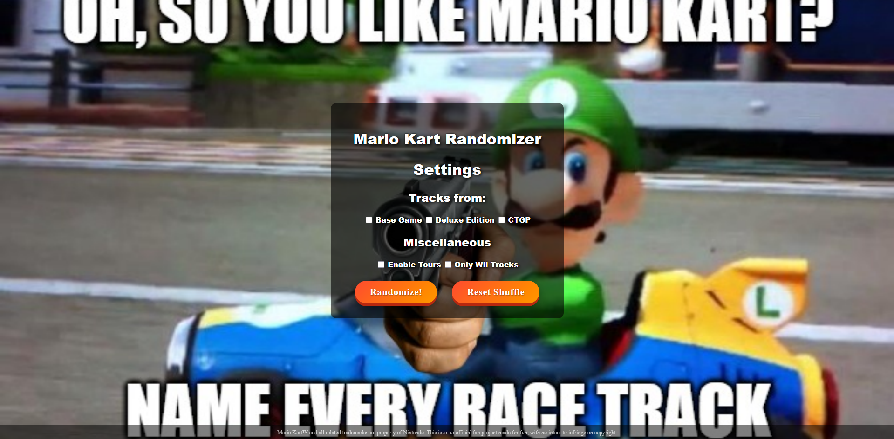
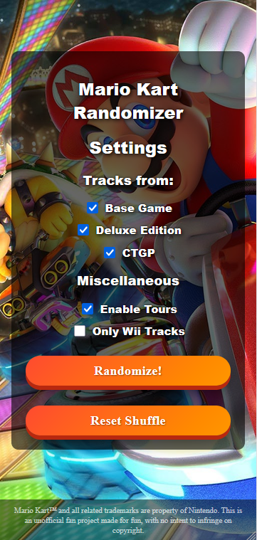

# Mario Kart randomizer

A simple Mario Kart randomizer. Feel free to try it out at [Mario Kart Track Randomizer](https://mintia11.github.io/mariokart-randomizer/)

<div align="center" style="display: flex; justify-content: center; gap: 10px;">


</div>

## Features:
- Random track selection from:
    * Base Game
    * The Deluxe DLC
    * CTGP Deluxe
- Disable the tour tracks
- Get only Wii tracks

## Run it locally

Run these commands:
```
git clone https://github.com/Mintia11/mariokart-randomizer
cd mariokart-randomizer
python -m http.server
```
Then open it at http://localhost:8000

## Credits:
Credits go to the [Mario Wiki](https://www.mariowiki.com) and the [Custom Mario Kart Wiki](https://mk8.tockdom.com) for all the images used in this site.

## Disclaimer
This is an unofficial, non-commercial fan project created for personal/educational use. Mario Kart, its characters, tracks, and all associated artwork and imagery are trademarks and copyrights of Nintendo Co., Ltd. This project is not affiliated with, endorsed by, or sponsored by Nintendo, and no copyright infringement is intended. All rights to the original content remain with their respective owners.